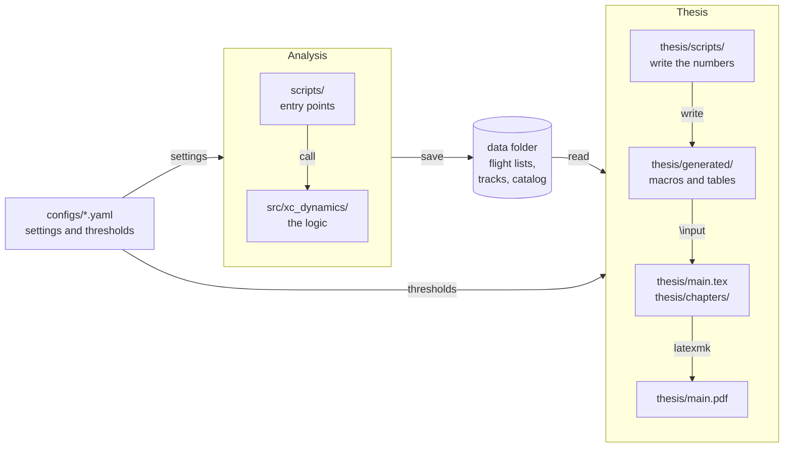

# Architecture

The repository has two halves. The **analysis** turns the FFVL archive into data and
results saved on disk. The **thesis** reads what was saved and turns it into the numbers
and tables of the PDF. Data flows one way, from the analysis to the thesis.

## The parts

### `src/xc_dynamics/`: the logic

All the code that does the work, one subpackage per function: `download/` fetches the
FFVL archive, `preprocessing/` reads the IGC tracks and tests them. A function takes
every setting as an argument: it never reads `configs/`, and never imports `scripts/`
or `thesis/`. So each function can be tested on its own (`tests/` mirrors this folder)
and is documented from its docstring in the [Reference](reference/download.md).

### `scripts/`: the entry points

One script per task, run from the command line. A script reads its settings in
`configs/`, calls the functions of `src/` and saves what they return in the data folder.
It only orchestrates: command-line options, the loop over seasons, progress and errors.
Today there is `download_ffvl.py` ([guide](guides/download.md)); the pre-processing
functions have no script yet.

### `configs/`: the settings

- `download.yaml`: data folders, seasons, parallel downloads. They depend on the machine.
- `preprocessing.yaml`: the thresholds of the pre-processing. They are part of the
  method, so the thesis quotes them.

### `thesis/`: the manuscript

- `main.tex`, `preamble.tex`, `chapters/`: the LaTeX source. The text never types a
  number that comes from the data or from a config: it writes a macro.
- `scripts/`: the scripts that write those macros. `config.py` turns the thresholds
  into macros; each chapter that quotes data has its own script (`02_dataset.py` for
  chapter 2). They read what the analysis saved and never run it: at most they count
  and take percentages.
- `generated/`: the `.tex` files these scripts write, read by `main.tex` and the
  chapters with `\input`. They are never edited by hand. They are committed, so the
  thesis compiles on a machine without the data folder.
- `build.sh`: runs the scripts, then compiles. See [Building the thesis](guides/thesis.md).

## Rules

- `src/` imports nothing from `scripts/` or `thesis/`. Both import `src/`; nothing
  imports them.
- The analysis never reads `thesis/`.
- A number in the thesis has one source, a config key or a saved result, and reaches
  the text through a macro.
